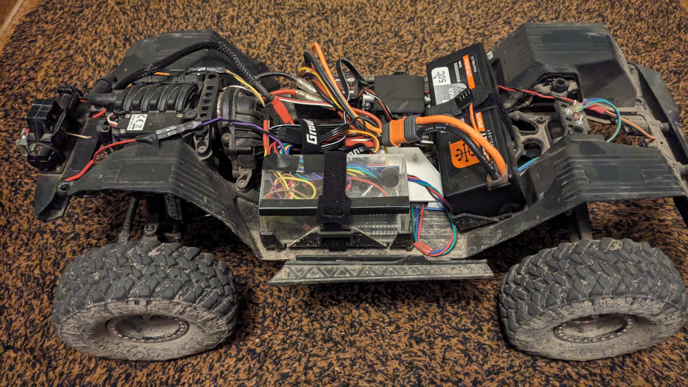

# RC Crawler accesories controller

See the [Monitor](https://github.com/samo1/rc-inclinometer-monitor-3) description for more information.

## Arduino Unit inside the car

### Winch

Winch controller uses PWM signal to control the motor.

### Inclinometer

Measured by the accelerometer sensor on the Arduino board in the car.
Sound warning is triggered on steep angles.

### Speed meter

Measured by hall effect sensor on transmission output shaft.

### Front dig function

Servo-controlled transmission function to block the rear wheels.

### Installation

Axial SCX10-3

Most of the electronics are installed inside the acrylic case.

